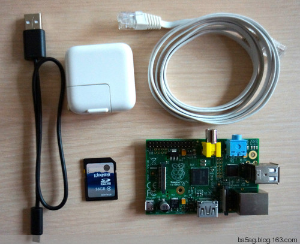
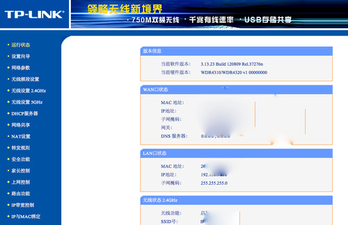
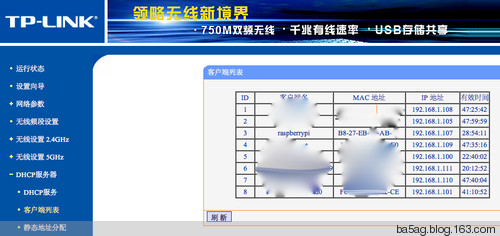
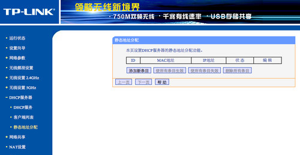
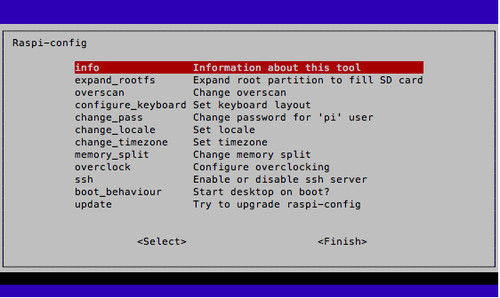

#徒手配树莓派

ba5ag.kai # gmail.com 2013-02-04

好吧，题目有点耸人，说是徒手，只是不需要显示器和键盘而已。

网上有无数的树莓派教程，都是告诉你如何接一个USB键盘和一个HDMI显示器，然后准备好SD卡来做初始配置的。不幸的是，支持HDMI的显示器在国内很不流行，而HDMI转VGA的线也要价不菲。其实现在的树莓派系统映像已经预先做好了大部分的配置，我们完全有可能不依赖显示器就把一个树莓派配置好。

如果你是个有经验的读者，不用往下看那么多废话，我只说一句：树莓派现在的SD里支持DHCP，也开启了sshd，所以你只要在一个支持DHCP的网络里把它开起来，从DHCP服务器那里得到它的IP地址，就可以ssh上去做任何想做的事情了。

好了，如果你还想仔细读一读的，我们开始了。

除了买来的树莓派板子，我们还需要以下条件：

 
* 一台PC，无论Mac OS或Linux都可以，哪怕是Windows也行。
* 一块4GB或以上的SD卡（有人试过最高到32GB），Class 10的比Class 4的好，因为速度快。这块卡就相当于你的PC的硬盘，Class 10可以被想像成7200转，所以，当然越快越好。
* 一条micro USB线，就是安卓手机用的那种扁扁的头子的线，给树莓派供电的。
* 一个2A的USB电源，比如iPad的电源就不错。B型树莓派的指标是700mA，但那是什么都不带的时候的耗电，所以，准备个能力充分一点的电源不是坏事。实在不行，1A的电源也是可以用一下的。再不济，找个能出2A的移动电源也是可以的。
* 一条以太网线。
* 家里的网络上有交换机，交换机上开了DHCP服务。这个得仔细说说，是徒手配树莓派的关键。

一般家里的网络，常见的配置是一个光纤或ADSL的猫，然后后面接了一个无线路由器。如果你只是猫后面直接接PC的，好吧，为了今后能更好地玩树莓派，去买一个带LAN接口的无线路由器吧，怎么配这个无线路由器自己去搜吧。如果你配的是一个无线AP，就是后面不带LAN接口的，要么你换一个带LAN接口的路由器，要么，我们还有续集，用串口配树莓派，那时候可以从串口登陆进去，配无线网卡来连接网络。

如果你买了个无线路由器来，没有仔细地配过，那么现在出厂的无线路由器都默认开启了DHCP，自动分配192.168.1.100到199之间的IP地址给申请DHCP服务的机器。你的iPhone、安卓手机就是这样上网的。如果之前为了不知道什么原因你把它关了，请开起来吧。

如果你在一个不受自己管理的网络，比如公司、实验室的网络、学校寝室的网络，那么，先试试这个网络是否支持DHCP。不幸的是，中国的网络管理员很不喜欢DHCP，原因未知。如果这个网络不支持DHCP，你又不可能通过社会工程的方法让网络管理员为你开启DHCP，好吧，简单的不求人的做法是，我们自己动手。不需要hack网络，我们自己架一个。如果你是计算机高手，在自己的电脑上安装一个DHCP服务器；如果你自己搞不定，那么，花钱总是会的吧。买一个路由器，几十块就可以了。当然，在这样一个网络上加一个路由器，你可以以NAT的方式，让你的PC和树莓派在路由器的后面，也可以把路由器挂在这个网络上面，就看网线是插WAN口还是LAN口了。好吧，这些内容太多了，不应该在我们这个树莓派的文章里说那么多网络的事情，你自己去google吧。假如你写了关于学校寝室如何架路由器提供DHCP的博客，请告诉我链接。

OK，东西都准备好了，要配置需要三个步骤：

* 准备SD卡
* 找到IP地址
* 登陆上去配置

##准备SD卡
这个已经有太多的网络资源了，我们就不在这里赘述了。自己去google吧。

##找到IP地址
现在把SD卡插入树莓派，把网线一头接路由器，一头接树莓派，接上电源。

你会看到电源灯亮起来，ACT灯闪闪，一会儿电源灯下面的几个网络灯也亮了起来。稍微等那么一两分钟。机器启动总是要时间的，现在它在努力地启动，无非我们看不到具体的进展而已，给它一点时间，对它要有点耐心。

这张照片里，我用了移动电源，就是图上那个黄绿色的大方块给树莓派供电。可以看到几个LED都亮了。

好了，现在，我们回到PC，开一个浏览器，输入你的路由器的IP地址，通常是192.168.1.1，输入路由器的配置用户名和密码，进去后就像这样：

 
 
点击左边的“DHCP服务器”->“客户端列表”，就出现这样的画面：

 
 
其中你会看到一个客户端名为“raspberrypi”的，记住它右边的IP地址，比如这里的192.168.1.107。这就是你的树莓派的IP地址。

如果你愿意，你可以给这个树莓派分配一个固定的地址，这样以后每次开机，它就能得到一个固定的IP，你就不需要到服务器上去找了。在客户端列表里拷贝树莓派的MAC地址，在路由器管理页面点击“DHCP服务器”->“静态地址分配”，出现下面的画面：

 

点击“添加新条目”，在“MAC地址”里粘贴刚才拷贝的树莓派的MAC地址，在“IP地址”里填入你希望它的IP地址，请避开DHCP分配的地址，使用比如192.168.1.199。最后按“保存”按钮。

每块树莓派的板子有自己的MAC地址，所以在一个局域网内有多块树莓派是安全的。

在DHCP服务器上分配固定地址，而不是在树莓派的IP地址设置中设置一个固定IP地址的好处是，下次你带着它去外面玩，在别人家的网络里，它还可以以DHCP的方式得到一个可用的地址，而不用担心固定设的地址不在网段内或与别人冲突。

##登陆上去配置

现在，进入你的终端，输入下面的命令：

	ssh pi@192.168.1.107

哦，我错了，亲爱的Windows用户，对不起，忘了什么叫终端吧，你们去找一个ssh工具吧，比如叫什么putty的就好。

如果你是第一次连接这个IP地址，它会出现下面的内容：

	The authenticity of host '192.168.1.107 (192.168.1.107)' can't be established.
	RSA key fingerprint is 1e:8d:db:3f:cd:45:2c:0f:86:4f:34:23:b4:94:b1:a1.
	Are you sure you want to continue connecting (yes/no)?

直接输入yes就好了。它会说：
	Warning: Permanently added '192.168.1.107' (RSA) to the list of known hosts.

如果在这之前你ssh过在这个IP地址上的其他的机器，包括今后如果你换了块SD卡再来ssh，它会出现下面的内容：

	@@@@@@@@@@@@@@@@@@@@@@@@@@@@@@@@@@@@@@@@@@@@@@@@@@@@@@@@@@@
	@    WARNING: REMOTE HOST IDENTIFICATION HAS CHANGED!     @
	@@@@@@@@@@@@@@@@@@@@@@@@@@@@@@@@@@@@@@@@@@@@@@@@@@@@@@@@@@@
	IT IS POSSIBLE THAT SOMEONE IS DOING SOMETHING NASTY!
	Someone could be eavesdropping on you right now (man-in-the-middle attack)!
	It is also possible that a host key has just been changed.
	The fingerprint for the RSA key sent by the remote host is
	d8:23:f2:ce:91:ab:fe:9a:0f:65:0b:89:cf:f7:76:89.
	Please contact your system administrator.
	Add correct host key in /Users/yourname/.ssh/known_hosts to get rid of this message.
	Offending RSA key in /Users/yourname/.ssh/known_hosts:8
	RSA host key for 192.168.1.107 has changed and you have requested strict checking.
	Host key verification failed.

这时候，你需要用一个编辑器，比如vi，打开~/.ssh/known_hosts，找到192.168.1.107那行，删除，然后就好了（如果你想起来应该如何用awk之类的文本工具删除那一行，请告诉我，非常感谢）。

总之，历经千辛万苦，你登上去了，它问你要密码：

	pi@192.168.1.107's password: 

这个是公开的和统一的：raspberry。登陆进去后，你会收到一条提示：

	NOTICE: the software on this Raspberry Pi has not been fully configured. Please run 'sudo raspi-config'

意思是这个树莓派还没有被完全配置过，那么按照它的要求，执行sudo rasp-config：

	pi@raspberrypi ~ $ sudo raspi-config

然后就和其他网上教程所看到的一样了。

 
 
我一般只做两个设置：扩展文件系统到整个盘，和设置时区，其他的以后再说好了。下次再登陆，你不会看到刚才那条NOTICE，但是rasp-config还是可以再次执行的。
